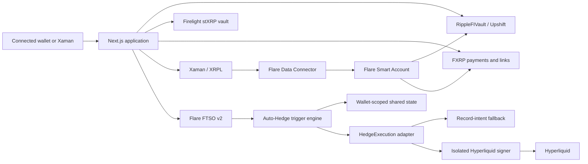

# RippleFI

**Earn with FXRP. Keep liquidity visible. Spend from available balances.**

RippleFI is an Earn + Spend application for XRP positions on Flare. It combines
real on-chain yield strategies, wallet and XRPL-based account flows, payments,
transaction history, and automated downside protection in one interface.

Users can:

- Deposit FXRP into the RippleFI vault and receive `rFXRP`.
- Route new mainnet deposits to Upshift or Firelight.
- Withdraw or pay from spend-ready RippleFI vault liquidity.
- Create and fulfill FXRP payment links.
- Deposit and spend through XRPL-authorized Smart Accounts.
- Arm Auto-Hedge rules using live Flare FTSO XRP pricing.
- Execute guarded XRP perpetual shorts through an isolated Hyperliquid signer.

> [!IMPORTANT]
> RippleFI is experimental software and has not undergone an independent
> security audit. Mainnet actions involve smart contract, strategy, oracle,
> liquidity, signer, and market risk.

## Product Model

RippleFI keeps earning routes and liquidity semantics explicit.

| Strategy | Position | Liquidity model | RippleFI payments |
| --- | --- | --- | --- |
| Upshift | `rFXRP` backed by the managed strategy | Synchronous withdrawals subject to current strategy liquidity and exit economics | Yes |
| Firelight | `stXRP` from direct FXRP staking | Scheduled Firelight withdrawal periods | No, exit to FXRP first |

Upshift remains the default and the only strategy on Coston2. Firelight is a
mainnet-only direct ERC-4626 position. Selecting Firelight does not silently
change the behavior of existing RippleFI withdrawals, payments, or Smart
Accounts.

## Shipped Capabilities

### Earn

- ERC-4626-compatible RippleFI vault with `rFXRP` share accounting.
- Live Upshift strategy integration on Flare mainnet and Coston2.
- Mainnet Firelight FXRP staking with `stXRP` position tracking.
- Strategy selection on Dashboard and Deposit.
- Per-wallet allocation and FXRP-equivalent position metrics.
- On-chain strategy share-price, backing, and liquidity reads.

### Spend

- Direct FXRP transfers.
- Payments funded from available wallet FXRP.
- Payments funded by withdrawing from the RippleFI vault directly to the
  recipient.
- Stateless, versioned payment links.
- Chain-aware transaction history and explorer routing.

### Smart Accounts

- XRPL address to deterministic Flare Personal Account resolution.
- Xaman-authorized direct minting and RippleFI deposits.
- FDC proof preparation and DA-layer polling.
- Atomic Smart Account approval plus vault deposit.
- Smart Account payments from available FXRP or vault liquidity.
- Chain-bound, signed executor jobs with server-only credentials.

### Auto-Hedge

- Live XRP/USD price reads from Flare FTSO v2.
- Absolute-price and percentage-drop triggers.
- Wallet-and-chain scoped rules shared across devices.
- Structured hedge intents and visible execution lifecycle.
- `record-intent-v1` safe fallback adapter.
- Guarded Hyperliquid XRP perpetual execution.
- Separate testnet proof mode and mainnet enable controls.
- Venue-aware XRP size precision and minimum-notional validation.

## Networks And Contracts

### Flare Mainnet

| Component | Value |
| --- | --- |
| Chain ID | `14` |
| RippleFIVault | `0xef80F749b39638958A90F93E475321E28C2989Bf` |
| Deployment block | `66439645` |
| FXRP | `0xAd552A648C74D49E10027AB8a618A3ad4901c5bE` |
| Upshift strategy | `0x373D7d201C8134D4a2f7b5c63560da217e3dEA28` |
| Firelight stXRP vault | `0x4C18Ff3C89632c3Dd62E796c0aFA5c07c4c1B2b3` |
| MasterAccountController | `0x434936d47503353f06750Db1A444DBDC5F0AD37c` |

### Coston2

| Component | Value |
| --- | --- |
| Chain ID | `114` |
| RippleFIVault | `0x57ccb558022a09f895376fbb58a849b6b5fd825b` |
| Deployment block | `33505125` |
| FXRP | `0x0b6A3645c240605887a5532109323A3E12273dc7` |
| Upshift strategy | `0x24c1a47cD5e8473b64EAB2a94515a196E10C7C81` |
| MasterAccountController | `0x434936d47503353f06750Db1A444DBDC5F0AD37c` |
| Personal Account implementation | `0xe900cf0C3f1320816700c669B002835aCc9A93A6` |

Network selection is explicit throughout the application. Vault addresses,
deployment blocks, explorers, payment payloads, history queries, Smart Account
jobs, FTSO reads, and Auto-Hedge execution adapters are chain-aware.

## Architecture



### Trust Boundaries

- Browser code never receives executor or Hyperliquid private keys.
- Smart Account executor credentials remain in server-only environment
  variables.
- Every Hyperliquid API-wallet private key belongs only to that user's
  isolated signer.
- RippleFI stores only wallet linkage and authorization status; signer
  credentials remain device-scoped.
- Shared Auto-Hedge writes require wallet-signed, chain-bound sessions.
- Hyperliquid mainnet execution is disabled unless explicitly enabled in both
  the frontend server and signer deployment.
- Firelight positions are not reported as immediately withdrawable or
  spendable RippleFI liquidity.

## Repository

```text
RippleFi/
|-- contracts/                     Solidity vault, deployment scripts, tests
|-- frontend/                      Next.js application and server routes
|-- services/
|   `-- hyperliquid-signer/        Isolated FastAPI execution signer
|-- docs/
|   |-- auto-hedge-phase-1.md
|   |-- mainnet-deployment.md
|   `-- smart-accounts-architecture.md
`-- README.md
```

## Technology

- Flare mainnet and Coston2
- FXRP and Flare FAssets
- Solidity `0.8.25`, OpenZeppelin, ERC-4626, Hardhat
- Next.js 16, React 19, TypeScript, wagmi, viem
- WalletConnect / Reown
- Xaman, XRPL, Flare FDC, and Flare FTSO v2
- Upstash Redis REST for shared Auto-Hedge state
- FastAPI and the official Hyperliquid Python SDK
- Vercel-compatible frontend and signer deployments

## Local Development

### Prerequisites

- Node.js 20 or newer
- Corepack and pnpm 11
- Python 3.10 through 3.12 for the signer service
- A WalletConnect project ID
- Testnet credentials and funded accounts for transaction flows

### Frontend

```powershell
git clone https://github.com/onchaindc/RippleFi.git
cd RippleFi\frontend
corepack enable
pnpm install
Copy-Item .env.example .env.local
pnpm dev
```

The application is available at `http://localhost:3000`.

On macOS or Linux, use `cp .env.example .env.local`.

### Contracts

```powershell
cd RippleFi\contracts
pnpm install
Copy-Item .env.example .env
pnpm compile
pnpm test
```

Useful commands:

```powershell
pnpm inspect:strategies
pnpm inspect:strategy:flare
pnpm prepare:flare
pnpm deploy:coston2
```

Flare mainnet deployment requires the explicit
`CONFIRM_MAINNET_DEPLOY=YES` safety acknowledgement.

### Hyperliquid Signer

```powershell
cd RippleFi\services\hyperliquid-signer
python -m venv .venv
.\.venv\Scripts\Activate.ps1
pip install -r requirements.txt
Copy-Item .env.example .env
.\scripts\run.ps1
```

The local health endpoint is `http://127.0.0.1:8787/healthz`.

## Environment Configuration

Use the committed templates as the source of truth:

- `frontend/.env.example`
- `contracts/.env.example`
- `services/hyperliquid-signer/.env.example`

### Frontend And Server Routes

| Area | Variables |
| --- | --- |
| Wallet connection | `NEXT_PUBLIC_WALLETCONNECT_PROJECT_ID`, `NEXT_PUBLIC_APP_URL` |
| Mainnet vault | `NEXT_PUBLIC_FLARE_VAULT_ADDRESS`, `NEXT_PUBLIC_FLARE_VAULT_DEPLOYMENT_BLOCK` |
| Xaman | `XAMAN_API_KEY`, `XAMAN_API_SECRET` |
| Smart Account executor | `SMART_ACCOUNT_EXECUTOR_PRIVATE_KEY`, `SMART_ACCOUNT_JOB_SECRET` |
| FDC | `FDC_VERIFIER_URL`, `FDC_MAINNET_VERIFIER_URL`, `FDC_VERIFIER_API_KEY` |
| Shared Auto-Hedge state | `UPSTASH_REDIS_REST_URL`, `UPSTASH_REDIS_REST_TOKEN`, `AUTO_HEDGE_SESSION_SECRET` |
| Execution routing | `AUTO_HEDGE_EXECUTION_ADAPTER`, `AUTO_HEDGE_TESTNET_EXECUTION_ADAPTER`, `AUTO_HEDGE_MAINNET_EXECUTION_ADAPTER`, `NEXT_PUBLIC_AUTO_HEDGE_*_VENUE`, `NEXT_PUBLIC_AUTO_HEDGE_*_MARKET` |
| Hyperliquid user linkage | Stored per wallet + chain in the shared Auto-Hedge store; signer URL/token remain on the user's device |
| SparkDEX Eternal executor | `SPARKDEX_ETERNAL_EXECUTION_ENABLED`, `SPARKDEX_ETERNAL_MARKETS`, `SPARKDEX_ETERNAL_EXECUTOR_URL`, `SPARKDEX_ETERNAL_EXECUTOR_AUTH_TOKEN` |
| Flamix executor | `FLAMIX_EXECUTION_ENABLED`, `FLAMIX_MARKETS`, `FLAMIX_EXECUTOR_URL`, `FLAMIX_EXECUTOR_AUTH_TOKEN` |

### Auto-Hedge Venue Matrix

`record-intent-v1` remains the default and fallback. Live execution is selected
per Flare chain:

| Chain | Adapter | Default market | Notes |
| --- | --- | --- | --- |
| Coston2 (114) | `hyperliquid-multi-market-v1` | `BTC` | Checks live Hyperliquid metadata and the signer allowlist. Uses a separately capped venue-unit size. |
| Flare (14) | `hyperliquid-xrp-perp-v1` | `XRP` | Existing guarded mainnet XRP short path. |
| Flare (14) | `sparkdex-eternal-v1` | `XRP` | Authenticated isolated executor; disabled until an approved SparkDEX integration host is configured. |
| Flare (14) | `flamix-v1` | `XRP` | Authenticated isolated executor for Flamix's on-chain request flow. |

Example Coston2 configuration:

```text
AUTO_HEDGE_TESTNET_EXECUTION_ADAPTER=hyperliquid-multi-market-v1
NEXT_PUBLIC_AUTO_HEDGE_TESTNET_VENUE=hyperliquid
NEXT_PUBLIC_AUTO_HEDGE_TESTNET_MARKET=BTC
AUTO_HEDGE_TESTNET_MARKETS=BTC,ETH,SOL
AUTO_HEDGE_TESTNET_ORDER_SIZE=0.0002
```

For Flare mainnet, keep `NEXT_PUBLIC_AUTO_HEDGE_MAINNET_MARKET=XRP` and select
one server adapter: `hyperliquid-xrp-perp-v1`, `sparkdex-eternal-v1`, or
`flamix-v1`. SparkDEX and Flamix require an explicit enable flag, HTTPS remote
executor, bearer token, and market allowlist. Missing integration state returns
an explicit unavailable error instead of a false execution receipt.

Users connect separate testnet/mainnet Hyperliquid accounts from Auto-Hedge.
The master wallet signs `approveAgent`, the shared backend stores only the
master/API wallet addresses and authorization status, and each execution must
present the matching user-specific signer session. Operator-shared accounts
are not used as a live-execution fallback.

### Signer-Only Secrets

The following belong only in the isolated signer deployment:

```text
HYPERLIQUID_API_WALLET_PRIVATE_KEY
HYPERLIQUID_SIGNER_AUTH_TOKEN
```

Never add either value to `NEXT_PUBLIC_*`, browser storage, or the RippleFI
frontend bundle.

## Verification

### Frontend

```powershell
cd frontend
pnpm exec tsc --noEmit --pretty false --incremental false
pnpm lint
pnpm build
```

### Contracts

```powershell
cd contracts
pnpm compile
pnpm test
```

### Signer

```powershell
cd services\hyperliquid-signer
.\.venv\Scripts\python.exe -m unittest discover -s tests -v
.\.venv\Scripts\python.exe -m py_compile app.py signer\main.py
```

## Deployment

The frontend and Hyperliquid signer must be deployed as separate projects.

1. Deploy `frontend/` as the RippleFI Next.js application.
2. Deploy `services/hyperliquid-signer/` as the isolated FastAPI signer.
3. Keep the signer private key only in the signer project.
4. Configure the signer URL and matching auth token in the frontend project.
5. Keep `record-intent-v1` selected until live execution is intentionally
   enabled.
6. Redeploy after changing environment variables.

Firelight requires no additional environment variable. Its configured mainnet
vault address is part of the chain-specific frontend configuration.

## Documentation

- [Auto-Hedge architecture](docs/auto-hedge-phase-1.md)
- [Smart Accounts architecture](docs/smart-accounts-architecture.md)
- [Hyperliquid signer operations](services/hyperliquid-signer/README.md)

## Security Notes

- Use dedicated deployment, executor, and API-wallet accounts.
- Do not commit `.env`, private keys, bearer tokens, or API credentials.
- Treat strategy withdrawal capacity and exit timing as runtime constraints.
- Keep mainnet execution size caps conservative.
- Monitor signer health, executor balances, FDC progress, and failed hedge
  receipts.
- Re-test deposit, withdrawal, payment, Smart Account, and Auto-Hedge flows
  after any network or contract configuration change.

## License

MIT
